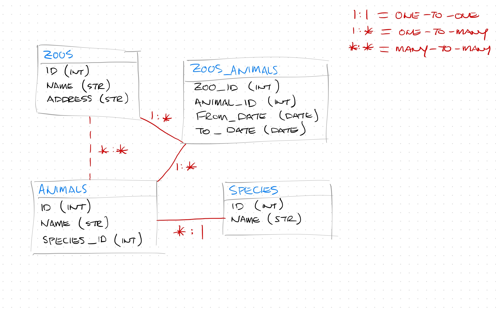

# Data Modeling

### Notes

1. Data Normalization
    We organize data in a database a little bit different than we do than how we do in a JavaScript object. This takes a little bit more thought and a little bit more planning.

    * Think about how we organize data in a JS object. In JS, it makes sense to nest those animals right in the object. It makes it easier to access that way. We can just iterate over the animals. You can just call `farm.animals` and you'll have that data. But this is non-persistent data. It's not saved anywhere. It's just sitting in our memory. 

        ```
        const farm = {
            id: 1,
            name: "Lon Lon Ranch",
            animals: { "horses", "cows", "chickens"}
        }
        ```
        
    * Relational Databases are a little bit different. If we formatted SQL this way in SQLite, we'd have some serious problems. For example: duplicated data, possible data anomalies (bugs resulting from unexpected data), etc. This is why we have to create our database schemas with _normalization_ in mind. 

    * **Normalization** - the process of designing our schema in a way that prevents redundancies. The JavaScript object above is considered _denormalized_ data at the moment since the list of animals is embedded right into the farm object. If we wanted to define another farm and also give it the same animals, we'd have to duplicate those string values. 

        ```
        const farm = {
            id: 1,
            name: "Lon Lon Ranch",
            animals: { "horses", "cows", "chickens"}
        }
        
        const farm2 = {
            id: 1,
            name: "Morton Ranch",
            animals: {"cows", "chickens"} // denormalized
        }
        ```

    * Guidelines for Data Normalization

        * No field value should be repeated

        * No redundant records - no 2 rows should be exactly the same

        * Each record has a unique primary key

        * All fields in a table should relate to the primary key (to the table itself)

            * You shouldn't have columns in a table that is not specific to that one resource

            * For example, animals don't exist _only_ in the context of a farm. They can also exist outside in the wild. That being the case, it doesn't make sense for our farms table to store information about animals (because animals don't directly relate to a farm).

    * Let's look at this from the viewpoint of the database. How would we organize those farm objects in SQLite?

        * The table below is just kind of mimicking the JavaScript object. This table is considered denormalized (at the moment). Since we're storing this list of animals directly in the farms table.


        ```
        // Table: farms

        id      name            animals
        ----------------------------------------------------

        1       Lon Lon Ranch   horses, chickens, cows
        ```


        * How would we normalize this data? Move the animals into its own table. Then we would use foreign keys to point back to the farms table.

        ```
        // Table: farms

        id      name            animals
        ----------------------------------------------------

        1       Lon Lon Ranch   horses, chickens, cows


        // Table: animals

        id      name        farm_id
        ------------------------------

        1       horses      1
        2       chickens    1
        3       cows        1
        ```


        * We're getting there in terms of normalizing our data. But, there's still a problem. Both the animal name and the farm_id are repeating. If you think about the data, you can have the same type of animals on several different farms.  For example, Morton Farm also has chickens and cows. Those two animals are redundant.
        

        ```
        // Table: farms

        id      name            animals
        ----------------------------------------------------

        1       Lon Lon Ranch   horses, chickens, cows
        2       Morton Farm     chickens, cows


        // Table: animals

        id      name        farm_id
        ------------------------------

        1       horses      1
        2       chickens    1
        3       cows        1
        4       chickens    2       // redundant
        5       cows        2       // redundant
        6       pigs        2
        ```


        * What if you needed to rename the string value of chickens to hens later down the line? We could write a SQL query that updates all the rows in the animals table with a WHERE statement. What if that query got cut short and only updated some of the rows but not others? It would create out of sync data (data anomalies).
        

        ```
        // Table: animals

        id      name        farm_id
        ------------------------------

        1       horses      1
        2       chickens    1       // not updated --- data anomaly
        3       cows        1
        4       hens        2       // updated
        5       cows        2       // redundant --- data anomaly
        6       pigs        2
        ```


        * How would we go a step further to prevent this data anomaly from happening? We would create a _third table_. 

            * This new, third table is going to act like a go between, between the farms table and the animals table. 

            * This way, we don't need the farms id in the animal table anymore. 

            * We can also remove the animals from the farms table. 

            * In order to associate an animal with a farm, we create a new entry in the third table, this go-between. We put in the farm_id and the animal_id. It associates that animal with that farm. 

            * This is an example of a **_Many-to-Many Relationship_**.


            ```
            // Table: farms

            id      name   
            ------------------------

            1       Lon Lon Ranch  
            2       Morton Farm     


            // Table: animals

            id      name   
            ------------------------

            1       horses 
            2       chickens 
            3       cows     
            4       hens 
            5       cows     
            6       pigs     


            // Table: farms_animals

            farm_id     animal_id
            ------------------------

            1           1   // LLR has horses
            1           2   // LLR has chickens
            1           3   // LLR has cows
            2           1   // MF has horses
            2           4   // MF has hens
            2           6   // MF has pigs
            ```

 
2. 3 Different Relationship Types
    Since we're working with relational DBMS, obviously tables can have relationships to other tables.      

    * **One-to-One Relationships** - Table A can only link to a single row in Table B and vice versa. It's usually only useful for splitting up tables that have a ton of columns. 
        
        * Example: Let's say our farms table also has a column called revenue for tracking the revenue of that farm. We split that revenue value out into another table. The new revenue table would link back to the farm table with the farm_id column, creating a one-to-one relationship. Additionally, the farms table no longer requires the revenue table but it would need to link to the revenue table allowing the communication between the two to happen.

        * It's not always necessary to create these one-to-one relationships like this, you could put the revenue column directly in the farms table and it would be fine in this case. But sometimes it's nice to split things up when you start dealing with a ton of columns in one table. 

        * In this particular example, the foreign key can go on either side of the relationship. It can either go on the farms table or the revenue table, or both in order to link one row to the other.  


        ```
        // Table: farms

        id      name           revenue_id 
        -------------------------------------

        1       Lon Lon Ranch   1
        2       Morton Farm     2

        // Table: revenue

        id      revenue         farm_id
        -------------------------------------

        1       56000           1
        2       142600          2
        ```


    * **One-to-Many Relationships** - Table A can link to many rows in Table B but the rows in Table B can only be associated with a single row in Table A. 
        
        * We've already seen an example of this with [Guided Project 3's](https://github.com/Amber-Pittman/node-db3-guided) users and blog posts. 

        * Another example, keeping in line with the farms during this lecture, let's say we also had a table tracking Ranchers or workers at that farm. A farm can have many different ranchers working on that farm and we're assuming ranchers can't work for different farms at the same time.

            * In this case, the foreign key is always going to go on the "many" side (the ranchers table). 


        ```
        // Table: farms (table A)

        | id    | name            | revenue_id | 
        |--------------------------------------| 
        | 1     | Lon Lon Ranch   | 1          | 
        | 2     | Morton Farm     | 2          | 

        // Table: ranchers (table B)

        | id      | name          | farm_id  | 
        |------------------------------------| 
        | 1       | Malone        | 1        | 
        | 2       | Talon         | 1        | 
        | 3       | Ingo          | 1        | 
        | 4       | Jane          | 2        | 
        | 5       | Jon           | 2        | 
        ```

        * Customers and Orders: A customer can have many orders but orders can belong only to a single customer. 

        * Blog posts and Comments are another example of One-to-Many Relationships.


    * **Many-to-Many Relationships** - Table A can link to many rows in Table B AND Table B can link to many rows in Table C
        
        * Our 3-table example is a bit more complicated because a farm can have many different animal types and the animal types can be found on many different farms. 


        ```
        // Table: farms  (table A)

        | id    | name              | 
        |---------------------------| 
        | 1     | Lon Lon Ranch     | 
        | 2     | Morton Farm       | 


        // Table: animals  (table B)

        | id    | name          |
        |-----------------------|
        | 1     | horses        |
        | 2     | chickens      |  
        | 3     | cows          | 
        | 4     | hens          | 
        | 5     | cows          |     
        | 6     | pigs          |     


        // Table: farms_animals  (table C)

        | farm_id  |   animal_id                 |
        |----------|-----------------------------|
        | 1        |   1   // LLR has horses     |
        | 1        |   2   // LLR has chickens   |
        | 1        |   3   // LLR has cows       |
        | 2        |   1   // MF has horses      |
        | 2        |   2   // MF has chickens    |   
        | 2        |   4   // MF has hens        |
        | 2        |   6   // MF has pigs        |
        ```


        * The third table is usually called an _intermediary table_, a _join table_, or a _go-between table_ whose only purpose is to hold the foreign key references for other tables. These particular tables are kind of weird because they don't need a specific id. The primary key can actually be a combination of the two foreign keys. 

            * For example, you can have many rows that use the farm ID of 1 and many rows that use the animal ID of 2; but if the primary key is a combination of the two columns, you can only have one row that uses a combination of those two IDs. 

                * Two farms use the chicken id, but their primary keys are different. 

                    * LLR's Primary Combo Key is 1 2
                    * MF's Primary Combo Key is 2 2

                * Every instance will be unique because of the way the primary key is set up. It's a combination of these two columns rather than a single ID column. 

        * Other examples of many-to-many:
            
            * Companies and Employees - Companies have many employees and employees can work at multiple companies at the same time.
            
            * People and Hobbies - Many people enjoy the same hobbies but there are also many hobbies enjoyed by individuals.
            
            * Countries and People - Dual citizens and countries have many citizens.
            
            * Stores and Products

    * **Q:** How do you decide on which type of relationship to use? 
      **A:** It depends on the relationship of the data. It goes back to what was discussed in the Guided Project 3 lecture. You have to think through the type of data that you're storing. 
    
      Before you actually code your schema, you have to think about your data. When you're thinking about the data, that's the time to decide what types of relationships should exist between different pieces of data. This should all happen in a planning phase before you actually create your database schema. 
            
### Code Along!

1. Before we write any code, there's this section called ["Client Requirements,"](README.md) that simulates this scenario that the client comes to us to build a database for them with specific requirements of what it needs to store. We have to take these requirements and actually build out that functional database for them. 

2. We are going to draw it all out before writing any code. It will help visualize the schema. Take a look at the client's requirements. 

    * The first table we need is Zoos. What columns should the zoos table have? 

        * ID (integer)

        * Name (string)

        * Address (string)

    * We also need an Animals table. The animals table needs what columns?

        * ID (integer)

        * Name (string)

        * Species ID (integer)
            
            * Species has it's own name. If we want this data to be normalized, we shouldn't store the species name in the animal table.

    * To normalize our species data, we create another table and link to it with a foreign key. 

        * ID (integer)

        * Name (string)

    * The relationship between Animal and Species is a one-to-many. We can represent that by drawing a line between the two boxes. We can define the relationship type as `1 : *`. 

    * The final requirement is to keep track of where an animal has resided in what zoos and the dates of residency. This means the Zoos table is related to the Animals table; just not related directly. It's a many-to-many relationship. Zoos can have many different animal types and those animal types can live at many different zoos. 

        * Since it's not a direct relationship, we can connect them with a dotted line and define it as `* : *` for many-to-many.  

    * We'll need to create a fourth table and call it Zoos_Animal. This will be the Join table (or the Go-Between table). It will provide the necessary connection for the indirect tables to communicate with each other by holding their foreign keys. 

        * We also have to keep track of when the animal was associated with the zoo. In addition to holding the foreign keys, the join table can also hold other types of metadata (in this case, when the animal actually lived at that particular zoo).

        * What columns does this table need?

            * Zoo_Id (integer)

            * Animals_Id (integer) 

            * Arrival_Date (date)

            * Departure_Date (date)

        * The Zoos_Animals table links to both the Animals table and the Zoos table using `1 : *` relationships. The Zoos_Animals creates the `* : *` relationship for the Animals and the Zoos tables. 

    * If we wanted to Normalize the data further, we could create another table for the Zoo Addresses. 


    <p align="center">
         
    </p>

    * Now we have an overview of how our database is going to look like. This will help us a lot when we actually start coding it. 

#### START CODING! 
    ```
    Video at 44:49 just before the 5 minute timer starts
    ```

1. Create a new migration file. `npx knex migration:make initial`

    * Look in data folder and open the initial migration file. 

    * Both of our functions need to be async

    * Create our Zoos table in the up function

    * Create the zoo id. It needs to auto increment an integer.

    * Create the name column. It will be a string. In SQL there's only one type of string: text. We can use string or varchar but then it will get converted to a text value. 

    * Create the address column. Make it unique since you can't have 2 zoos at the same location. 

    * Drop the table in the down function if it exists. 

    ```
    exports.up = async function(knex) {
        await knex.schema.createTable("zoos", (table) => {
            table.increments("id")
            table.text("name").notNull()
            table.text("address").notNull().unique()
        })
    }

    exports.down = async function(knex) {
        await knex.schema.dropTableIfExists("zoos")
    }
    ```

2. Create the Zoos Table
    * Create the zoos db3 file by running the migration. `npx knex migration:latest`

    * Open the db3 file in DB Browser. You'll see the zoos table. 

    * Since we're not quite done with the migration yet and we haven't actually deployed this to the live database, just roll it back. `npx knex migration: rollback`.

    * While you could do a new migration for each table, but normally you should think of migration in terms of changes to your database over time instead of tables. Each migration file represents a chunk of time. 
        
        * During a specific period of time, you'd put all your data into one migration. Then, when you come back later, you'd create a new migration file. 

3. Create the Animal Table. 

    * The animal table needs an ID, name, and species id. 

    * Go back to your migration file (the initial.js file).

    * Inside the up function, create the new table. 

    * Create the id column.

    * Create the name column. We do want to make this one unique, because you can't really have 2 animal types with the same name. That would result in a data anomaly. 

    * The species id column is a little tricky. It's a foreign key pointing to the species table. Foreign keys have to be the same data type as the primary keys they're pointing at, which is going to be an integer. 

        * To actually create that foreign key, use references. Give references the id column then use inTable and select the species table. That creates the relationship for us. 

    * Add the animals table to our down function to destroy it if it exists. 

    ```
    exports.up = async function(knex) {
        await knex.schema.createTable("zoos", (table) => {
            table.increments("id")
            table.text("name").notNull()
            table.text("address").notNull().unique()
        })

        await knex.schema.createTable("animals", (table) => {
            table.increments("id")
            table.text("name").notNull().unique()
            table.integer("species_id").references("id").inTable("species").notNull().unique()
        })
    }

    exports.down = async function(knex) {
        await knex.schema.dropTableIfExists("animals")
        await knex.schema.dropTableIfExists("zoos")
    }
    ```
3. Create the Species Table

    * The species table needs an ID and a name.

    * Inside the up function, create the new table. 

    * Create the id column.

    * Run the latest migration to make sure you don't have any syntax errors. `npx knex migrate:latest` The three tables are all there with all their columns. 

    * What's a potential problem you see with the order we're creating these tables in? We didn't get any errors but are there any code in this that could potentially be problematic if you think through how this is running? 
        
        * **A:** We're creating this foreign key _before_ the species table exists. We're defining the speciesId corresponding before its table even exists. 

        Order of operations is very important when dealing with relationships. We need to make sure the table exists before we try to make the animals table reference it. 

        We can easily correct it by moving the species table up before the animals table on the up function. 

        In the down function, we can't really delete the species table before the animals table because animals is referencing it. 

    * Rollback the migration again. `npx knex migrate:rollback`

    ```
    exports.up = async function(knex) {
        await knex.schema.createTable("zoos", (table) => {
            table.increments("id")
            table.text("name").notNull()
            table.text("address").notNull().unique()
        })

        await knex.schema.createTable("species", (table) => {
            table.increments("id")
            table.text("name").notNull().unique()
        })

        await knex.schema.createTable("animals", (table) => {
            table.increments("id")
            table.text("name").notNull().unique()
            table.integer("species_id").references("id").inTable("species")
        })

    }

    exports.down = async function(knex) {
        await knex.schema.dropTableIfExists("animals")
        await knex.schema.dropTableIfExists("species")
        await knex.schema.dropTableIfExists("zoos")
    }
    ```

4. Create the Zoos_Animals Table
    
    * The zoos animals table needs a zoo id, animal id, a from-date, and a to-date.

    * This time, the ID is not going to have an increments column. We don't need a primary key on this table.

    * Use the zooId as a foreign key by using references and refer to the zoos table.

    * Ditto for animalId. 

    * Define both of the date columns. 
    
    * Create a default on the to_date using the function knex.raw. We pass in a string of current timestamp. This allows us to automatically creates the start date. 

        * `knex.raw` will pass `current_timestamp` without quotes; meaning it's an internal SQL variable and not a literal string

        * Instead, it's an expression, so it'll use the actual current timestamp for a default value. 

    * Give it a primary key. 
        
        * Even though it doesn't have an ID column, we still need to provide a primary key. Every table _must_ have a unique primary key. But since our primary key is a combination of both columns, you can define it with `.primary` and give it an array of two column names.

    * Drop the zoos animals table first in the down function.

    * Rollback the migration with `npx knex migrate:rollback` before migrating the latest again `npx knex migrate:latest`.

    * Check your database. All tables are there with their primary keys. Zoo Animals has 2 primary keys on it as expected. 


    ```
    exports.up = async function(knex) {
        await knex.schema.createTable("zoos", (table) => {
            table.increments("id")
            table.text("name").notNull()
            table.text("address").notNull().unique()
        })

        await knex.schema.createTable("species", (table) => {
            table.increments("id")
            table.text("name").notNull().unique()
        })

        await knex.schema.createTable("animals", (table) => {
            table.increments("id")
            table.text("name").notNull().unique()
            table.integer("species_id").references("id").inTable("species")
        })

        await knex.schema.createTable("zoos_animals", (table) => {
        table.integer("zoo_id").references("id").inTable("zoos")
        table.integer("animal_id").references("id").inTable("animals")
        table.date("from_date").defaultTo(knex.raw("current_timestamp"))
        table.date("to_date")
        table.primary(["zoo_id", "animal_id"])
        })
    }

    exports.down = async function(knex) {
        await knex.schema.dropTableIfExists("zoos_animals")
        await knex.schema.dropTableIfExists("animals")
        await knex.schema.dropTableIfExists("species")
        await knex.schema.dropTableIfExists("zoos")
    }
    ```

`Stopping Point Video at 1:15:48`